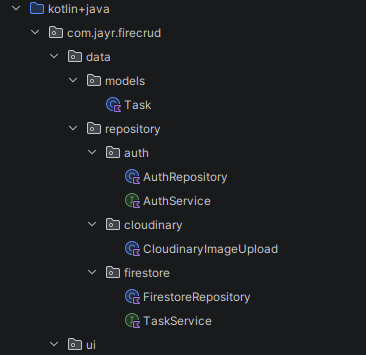

Prerequisite: 
- Create Firebase project via the frirebase console
- Create cloudinary account (what this:https://youtu.be/b2RE0f95_vc?si=38N07f6ssTGPKNLx&t=162) 
- 
## MVVM Architecture


Use this [repository](https://github.com/JosephRidge/MVVMSafari) to help.

## Application Architecture 


##  User Flow Diagram


# **Data Layer**
## Data Section file structure


## Task Model:
``` kotlin
data class Task(
    val id: String = "",
    val userId: String = "",
    val title: String = "",
    val description: String = "",
    val imageUrls: List<String> = emptyList(),
    val isCompleted: Boolean = false,
    val createdAt: Long = System.currentTimeMillis(),
    val updatedAt: Long = System.currentTimeMillis(),
    val dueDate: Long? = null
)
```
## Interface to be added inside the repository directory
- The interface is like a contract that states, you must implement the following methods, in this case it is to perform CRUD operations
``` Kotlin
interface TaskService {
    fun observeTasks(userId: String): Flow<List<Task>>   // Read (continuous)
    suspend fun getTask(taskId: String ): Task?            // Read (one-shot)
    suspend fun addTask(task: Task, localImagePaths: List<String>): Task                // Create
    suspend fun updateTask(task: Task, localImagePaths: List<String>) :Task            // Update
    suspend fun deleteTask(taskId: String)   // Delete
}
```

## FirestoreRepository
```Kotlin
class FirestoreRepository(
    private val firestore: FirebaseFirestore,
    private val cloudinaryImageUpload: CloudinaryImageUpload

) : TaskService {
    private val tasksRef get() = firestore.collection("tasks")

    /*
    * Note:
    * Flow<List<Task>>: think of a Flow as a stream of data over time, rather than a single value returned once. Every time the underlying data changes, a new list gets pushed out through the stream.
    callbackFlow { ... }: Firestore's real-time listener (addSnapshotListener) works with old-style callbacks, not Kotlin coroutines. callbackFlow is a bridge that lets us wrap that callback-based API and turn it into a proper Flow.
    whereEqualTo / orderBy: this builds our query: only fetch tasks belonging to userId, sorted newest-first by createdAt.
    addSnapshotListener: this is Firestore's way of saying "watch this query, and call me back every time something changes" (a task added, edited, deleted, etc.), not just once.
    trySend(tasks): every time the listener fires with new data, we push the updated task list into the Flow so anyone collecting it (like your ViewModel or UI) gets the fresh list automatically.
    close(error): if Firestore reports an error, we shut down the flow and pass the error along, instead of silently failing.
    awaitClose { listener.remove() }: this is the cleanup step. It only runs when whoever is collecting the flow stops listening (e.g., the screen is closed). At that point we detach the Firestore listener so it's not running forever in the background, wasting reads and battery.
    *
    * */
    override fun observeTasks(userId: String): Flow<List<Task>> = callbackFlow {
        val listener = tasksRef
            .whereEqualTo("userId", userId)
            .orderBy("createdAt", Query.Direction.DESCENDING)
            .addSnapshotListener { snapshot, error ->
                if (error != null) {
                    close(error)
                    return@addSnapshotListener
                }
                val tasks =
                    snapshot?.documents?.mapNotNull { it.toObject(Task::class.java) } ?: emptyList()
                trySend(tasks)
            }
        awaitClose { listener.remove() }
    }

    /*
    * Uploads any local image files first, then attaches the resulting
    * Cloudinary URLs to imageUrls before writing the task to Firestore.
    * Uploading before the Firestore write means we never save a task
    * that references images that failed to upload.
    */
    override suspend fun addTask(task: Task, localImagePaths: List<String>): Task {
        val docRef = tasksRef.document()
        val uploadedUrls = if (localImagePaths.isNotEmpty()) {
            cloudinaryImageUpload.uploadImages(localImagePaths)
        } else {
            emptyList()
        }
        val withId = task.copy(
            id = docRef.id,
            imageUrls = task.imageUrls + uploadedUrls
        )
        docRef.set(withId).await()
        return withId
    }

    /*
    * Uploads any new local images and appends their URLs to the task's
    * existing imageUrls, then overwrites the document. Also refreshes
    * updatedAt since this represents a modification.
    *
    * Note: this only adds images — it doesn't handle removing individual
    * images from imageUrls. That's a UI-level concern: if your edit screen
    * lets users remove an image, just pass in a Task whose imageUrls list
    * already has that entry stripped out, and this function will save it
    * as-is via .set().
    */
    override suspend fun updateTask(task: Task, localImagePaths: List<String>): Task {
        val uploadedUrls = if (localImagePaths.isNotEmpty()) {
            cloudinaryImageUpload.uploadImages(localImagePaths)
        } else {
            emptyList()
        }
        val updatedTask = task.copy(
            imageUrls = task.imageUrls + uploadedUrls,
            updatedAt = System.currentTimeMillis()
        )
        tasksRef.document(updatedTask.id).set(updatedTask).await()
        return updatedTask
    }

    override suspend fun getTask(taskId: String): Task? =
        tasksRef.document(taskId).get().await().toObject(Task::class.java)

    /*
    * Deletes the Firestore document only. The images referenced in
    * imageUrls are left behind on Cloudinary — deleting them requires
    * your api_secret via a signed backend/Admin API call, which can't
    * safely run on-device. A production app would send task.imageUrls
    * to a backend endpoint here to trigger cleanup.
    */
    override suspend fun deleteTask(taskId: String) {
        tasksRef.document(taskId).delete().await()
    }
}
```

# **UI Layer**
My assumption is that you have already set up navigation, hence on the MainActivity remove `Greetings()` composable  together with the `@Preview`, so move from this: 
```Kotlin
class MainActivity : ComponentActivity() {
    override fun onCreate(savedInstanceState: Bundle?) {
        super.onCreate(savedInstanceState)
        enableEdgeToEdge()
        setContent {
            FireCRUDTheme {
                Scaffold(modifier = Modifier.fillMaxSize()) { innerPadding ->
                    Greeting(
                        name = "Android",
                        modifier = Modifier.padding(innerPadding)
                    )
                }
            }
        }
    }
}

@Composable
fun Greeting(name: String, modifier: Modifier = Modifier) {
    Text(
        text = "Hello $name!",
        modifier = modifier
    )
}

@Preview(showBackground = true)
@Composable
fun GreetingPreview() {
    FireCRUDTheme {
        Greeting("Android")
    }
}
```

to this:
```Kotlin

class MainActivity : ComponentActivity() {
    override fun onCreate(savedInstanceState: Bundle?) {
        super.onCreate(savedInstanceState)
        enableEdgeToEdge()
        setContent {
            FireCRUDTheme {
                val navController = rememberNavController()
                Scaffold(modifier = Modifier.fillMaxSize()) { innerPadding ->
                    Navigation(
                        modifier = Modifier.padding(innerPadding),
                        navHostController = navController
                    )
                }
            }
        }
    }
}
```
## File Structure


## UI
Kindly note for the homescreen and tasklist item they are currently located in the `HomeScreen.kt` file however, it is best practice to separate them, but first objective make sure it works.
HomeScreen
```Kotlin

@Composable
fun HomeScreen(
    userId: String,
    homeViewModel: HomeViewModel = viewModel(),
    onTaskClick: (Task) -> Unit = {}
) {
    val uiState by homeViewModel.uiState.collectAsState()
    val tasks by homeViewModel.tasks.collectAsState()
    val responseMessage by homeViewModel.responseMessage.collectAsState()

    LaunchedEffect(userId) {
        homeViewModel.loadTasks(userId)
    }

    Column(modifier = Modifier.fillMaxSize().padding(16.dp)) {
        Text("My Tasks", style = MaterialTheme.typography.headlineSmall)
        Spacer(Modifier.height(8.dp))

        when (uiState) {
            is TaskUIState.isLoading -> {
                Box(modifier = Modifier.fillMaxSize(), contentAlignment = Alignment.Center) {
                    CircularProgressIndicator()
                }
            }
            is TaskUIState.isError -> {
                Text(
                    text = responseMessage,
                    color = MaterialTheme.colorScheme.error
                )
            }
            else -> {
                if (tasks.isEmpty()) {
                    Text("No tasks yet. Tap + to add one.")
                } else {
                    LazyColumn(verticalArrangement = Arrangement.spacedBy(8.dp)) {
                        items(tasks, key = { it.id }) { task ->
                            TaskListItem(task = task, onClick = { onTaskClick(task) })
                        }
                    }
                }
            }
        }
    }
}
```


TaskItemCard Component 
```Kotlin

//component for each task
@Composable
fun TaskListItem(task: Task, onClick: () -> Unit) {
    Card(
        onClick = onClick,
        modifier = Modifier.fillMaxWidth()
    ) {
        Column(modifier = Modifier.padding(12.dp)) {
            Text(task.title, style = MaterialTheme.typography.titleMedium)
            if (task.description.isNotBlank()) {
                Text(
                    task.description,
                    style = MaterialTheme.typography.bodySmall,
                    maxLines = 2,
                    overflow = TextOverflow.Ellipsis
                )
            }
        }
    }
}
```

Task form to upload tasks + images
```Kotlin
@Composable
fun TaskForm(
    existingTask: Task? = null,
    taskFormViewModel: TaskFormViewModel = viewModel()
) {
//   states
    val titleState = rememberTextFieldState("")
    val descriptionState = rememberTextFieldState("")
    /*
    * Kindly note: 
        For 'by' in:
           var localImagePaths by remember { mutableStateOf<List<String>>(emptyList()) }    val pickImagesLauncher = rememberLauncherForActivityResult(
             contract = ActivityResultContracts.PickMultipleVisualMedia()
            ) { uris ->
                localImagePaths = uris.map { it.toString() }
            }
     you need to import:
        import androidx.compose.runtime.getValue
        import androidx.compose.runtime.setValue
     */
    var localImagePaths by remember { mutableStateOf<List<String>>(emptyList()) }
    val pickImagesLauncher = rememberLauncherForActivityResult(
        contract = ActivityResultContracts.PickMultipleVisualMedia()
    ) { uris ->
        localImagePaths = uris.map { it.toString() }
    }

    Column(modifier = Modifier.padding(16.dp)) {
        OutlinedTextField(
            state = titleState,
            label = { Text("Title") }
        )
        Spacer(Modifier.height(8.dp))
        OutlinedTextField(
            state = descriptionState,
            label = { Text("Description") }
        )
        Spacer(Modifier.height(8.dp))
        Button(onClick = {
            pickImagesLauncher.launch(
                PickVisualMediaRequest(ActivityResultContracts.PickVisualMedia.ImageOnly)
            )
        }) { Text("Add Images") }
        Spacer(Modifier.height(8.dp))
        Button(onClick = {
            val task = (existingTask ?: Task()).copy(
                title = titleState.text.toString(),
                description = descriptionState.text.toString()
            )
            taskFormViewModel.createTask(task, localImagePaths)
        }) { Text("Save Task") }
    }
}
```
## View Models

TaskViewModel
```Kotlin

class TaskFormViewModel(
    private val firestoreRepository: FirestoreRepository
): ViewModel() {

//     states
    private var _uiState: MutableStateFlow<TaskUIState> = MutableStateFlow(TaskUIState.isIdle)
    val uiState = _uiState.asStateFlow()
    private var _responseMessage: MutableStateFlow<String> = MutableStateFlow("")
    val responseMessage = _responseMessage.asStateFlow()

 
//    methods (just functions in classes)
fun createTask(task: Task, localImagePaths: List<String>) {
    viewModelScope.launch {
        _uiState.value = TaskUIState.isLoading
        try {
            firestoreRepository.addTask(task, localImagePaths)
            _uiState.value = TaskUIState.isSuccess
            _responseMessage.value = "Task created successfully."
        } catch (e: Exception) {
            _uiState.value = TaskUIState.isError
            _responseMessage.value = e.message.toString()
        }
    }
}

    fun updateTask(task: Task, localImagePaths: List<String>) {
        viewModelScope.launch {
            _uiState.value = TaskUIState.isLoading
            try {
                firestoreRepository.updateTask(task, localImagePaths)
                _uiState.value = TaskUIState.isSuccess
                _responseMessage.value = "Task updated successfully."
            } catch (e: Exception) {
                _uiState.value = TaskUIState.isError
                _responseMessage.value = e.message.toString()
            }
        }
    }
}
```

HomeViewModel
```Kotlin

class HomeViewModel(
    private val firebaseRepository: FirestoreRepository
): ViewModel() {
    private var _uiState: MutableStateFlow<TaskUIState> = MutableStateFlow(TaskUIState.isIdle)
    val uiState = _uiState.asStateFlow()
    private var _tasks: MutableStateFlow<List<Task>> = MutableStateFlow(emptyList())
    val tasks = _tasks.asStateFlow()
    private var _responseMessage: MutableStateFlow<String> = MutableStateFlow("")
    val responseMessage = _responseMessage.asStateFlow()

//     load tasks
    fun loadTasks(userId: String) {
        viewModelScope.launch {
            _uiState.value = TaskUIState.isLoading
            try {
                firebaseRepository.observeTasks(userId).collect { taskList ->
                    _tasks.value = taskList
                    _uiState.value = TaskUIState.isSuccess
                }
            } catch (e: Exception) {
                _uiState.value = TaskUIState.isError
                _responseMessage.value = e.message.toString()
            }
        }
    }
}

```